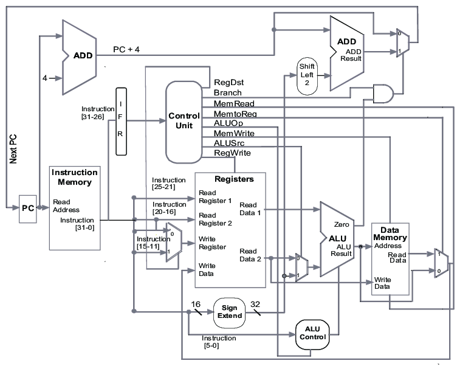
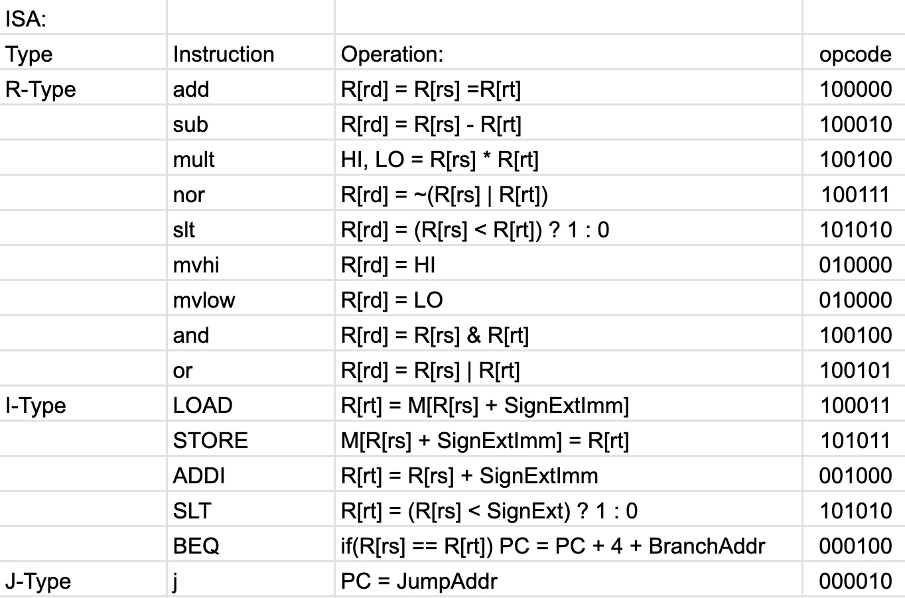

[](https://classroom.github.com/a/pelSJLGu)




# Catalog of Verilog Components to Build and Simulate a MIPS-based RISC.

This work is based off the MIPS Verilog code by [Harris and Harris](https://pages.hmc.edu/harris/ddca/ddca2e.html)

The basis of the single cycle computer as provided by these Verilog components:

```verilog
// mips.sv
// From Section 7.6 of Digital Design & Computer Architecture
// Updated to SystemVerilog 26 July 2011 David_Harris@hmc.edu
`timescale 1ms/100us // 1ms period, 100us precision

module mips_single_cycle_tb();

  logic        clk;
  logic        reset;

  logic [31:0] writedata, dataadr;
  logic        memwrite;

  logic firstTest, secondTest;

  // instantiate device to be tested
  top dut(clk, reset, writedata, dataadr, memwrite);

  initial
  begin
      firstTest = 1'b0;
      secondTest = 1'b0;
      $dumpfile("mips_single_cycle_test.vcd");
      $dumpvars(0,clk,reset,writedata,dataadr,memwrite);
      // $display("writedata\tdataadr\tmemwrite");
      $monitor("0x%7h\t%7d\t%8d",writedata,dataadr,memwrite);
      // $dumpvars(0,clk,a,b,ctrl,result,zero,negative,carryOut,overflow);
      // $display("Ctl Z  N  O  C  A                    B                    ALUresult");
      // $monitor("%3b %b  %b  %b  %b  %8b (0x%2h;%3d)  %8b (0x%2h;%3d)  %8b (0x%2h;%3d)",ctrl,zero,negative,overflow,carryOut,a,a,a,b,b,b,result,result,result);
  end

  // initialize test
  initial
    begin
      reset <= 1; # 22; reset <= 0;
    end

  // generate clock to sequence tests
  always
    begin
      clk <= 1; # 5; clk <= 0; # 5;
    end

  always @(posedge clk)
  begin
      $display("+");
      $display("\t+instr = 0x%8h",dut.instr);
      $display("\t+op = 0b%6b",dut.mips.c.op);
      $display("\t+controls = 0b%9b",dut.mips.c.md.controls);
      $display("\t+funct = 0b%6b",dut.mips.c.ad.funct);
      $display("\t+aluop = 0b%2b",dut.mips.c.ad.aluop);
      $display("\t+alucontrol = 0b%3b",dut.mips.c.ad.alucontrol);
      $display("\t+alu result = 0x%8h",dut.mips.dp.alu.result);
      $display("\t+HiLo = 0x%8h",dut.mips.dp.alu.HiLo);
      $display("\t+$v0 = 0x%4h",dut.mips.dp.rf.rf[2]);
      $display("\t+$v1 = 0x%4h",dut.mips.dp.rf.rf[3]);
      $display("\t+$a0 = 0x%4h",dut.mips.dp.rf.rf[4]);
      $display("\t+$a1 = 0x%4h",dut.mips.dp.rf.rf[5]);
      $display("\t+$t0 = 0x%4h",dut.mips.dp.rf.rf[8]);
      $display("\t+$t1 = 0x%4h",dut.mips.dp.rf.rf[9]);
      $display("\t+regfile -- ra1 = %d",dut.mips.dp.rf.ra1);
      $display("\t+regfile -- ra2 = %d",dut.mips.dp.rf.ra2);
      $display("\t+regfile -- we3 = %d",dut.mips.dp.rf.we3);
      $display("\t+regfile -- wa3 = %d",dut.mips.dp.rf.wa3);
      $display("\t+regfile -- wd3 = %d",dut.mips.dp.rf.wd3);
      $display("\t+regfile -- rd1 = %d",dut.mips.dp.rf.rd1);
      $display("\t+regfile -- rd2 = %d",dut.mips.dp.rf.rd2);
      $display("\t+RAM[%4d] = %4d",dut.dmem.a,dut.dmem.rd);
      $display("writedata\tdataadr\tmemwrite");
  end

  // check results
  always @(negedge clk)
    begin
      $display("-");
      $display("\t-instr = 0x%8h",dut.instr);
      $display("\t-op = 0b%6b",dut.mips.c.op);
      $display("\t-controls = 0b%9b",dut.mips.c.md.controls);
      $display("\t-funct = 0b%6b",dut.mips.c.ad.funct);
      $display("\t-aluop = 0b%2b",dut.mips.c.ad.aluop);
      $display("\t-alucontrol = 0b%3b",dut.mips.c.ad.alucontrol);
      $display("\t-alu result = 0x%8h",dut.mips.dp.alu.result);
      $display("\t-HiLo = 0x%8h",dut.mips.dp.alu.HiLo);
      $display("\t-$v0 = 0x%4h",dut.mips.dp.rf.rf[2]);
      $display("\t-$v1 = 0x%4h",dut.mips.dp.rf.rf[3]);
      $display("\t-$a0 = 0x%4h",dut.mips.dp.rf.rf[4]);
      $display("\t-$a1 = 0x%4h",dut.mips.dp.rf.rf[5]);
      $display("\t-$t0 = 0x%4h",dut.mips.dp.rf.rf[8]);
      $display("\t-$t1 = 0x%4h",dut.mips.dp.rf.rf[9]);
      $display("\t-regfile -- ra1 = %d",dut.mips.dp.rf.ra1);
      $display("\t-regfile -- ra2 = %d",dut.mips.dp.rf.ra2);
      $display("\t-regfile -- we3 = %d",dut.mips.dp.rf.we3);
      $display("\t-regfile -- wa3 = %d",dut.mips.dp.rf.wa3);
      $display("\t-regfile -- wd3 = %d",dut.mips.dp.rf.wd3);
      $display("\t-regfile -- rd1 = %d",dut.mips.dp.rf.rd1);
      $display("\t-regfile -- rd2 = %d",dut.mips.dp.rf.rd2);
      $display("\t+RAM[%4d] = %4d",dut.dmem.a,dut.dmem.rd);
      $display("writedata\tdataadr\tmemwrite");
      if (dut.dmem.RAM[84] === 32'h9504)
        begin
          $display("Successfully wrote 0x%4h at RAM[%3d]",84,32'h9504);
          firstTest = 1'b1;
        end
      if (dut.dmem.RAM[88] === 0)
        begin
          $display("Successfully wrote 0x%4h at RAM[%3d]",88,0);
          secondTest = 1'b1;
        end
      if(memwrite) begin
        if(dataadr === 84 & writedata === 32'h9504)
        begin
          $display("Successfully wrote 0x%4h at RAM[%3d]",writedata,dataadr);
          firstTest = 1'b1;
        end
        if(dataadr === 88 & writedata === 0)
        begin
          $display("Successfully wrote 0x%4h at RAM[%3d]",writedata,dataadr);
          secondTest = 1'b1;
        //if(dataadr === 60 & writedata === 28) begin
            // $display("Simulation succeeded");
            // $finish;
          // end
        end
        // else if (dataadr !== 80) begin
        //   $display("Simulation failed");
        //   $finish;
        // end
      end
      if (firstTest === 1'b1 & secondTest === 1'b1)
      begin
          $display("Program successfully completed");
          $finish;
      end
      // else
      // begin
      //     $display("Program UNsuccessfully completed");
      //     $finish;
      // end
    end
endmodule

module top(input  logic        clk, reset,
           output logic [31:0] writedata, dataadr,
           output logic        memwrite);

  logic [31:0] pc, instr, readdata;

  // instantiate processor and memories
  mips mips(clk, reset, pc, instr, memwrite, dataadr,
            writedata, readdata);
  imem imem(pc[7:2], instr);
  dmem dmem(clk, memwrite, dataadr, writedata, readdata);
endmodule

module dmem(input  logic        clk, we,
            input  logic [31:0] a, wd,
            output logic [31:0] rd);

  logic [31:0] RAM[0:63];

  assign rd = RAM[a[31:2]]; // word aligned

  always @(posedge clk)
    if (we) RAM[a[31:2]] <= wd;
endmodule

module imem(input  logic [5:0] a,
            output logic [31:0] rd);

  logic [31:0] RAM[0:63];

  initial
    begin
      // read memory in hex format from file
      $readmemh("memfile.dat",RAM);
    end

  assign rd = RAM[a]; // word aligned
endmodule

module mips(input  logic        clk, reset,
            output logic [31:0] pc,
            input  logic [31:0] instr,
            output logic        memwrite,
            output logic [31:0] aluout, writedata,
            input  logic [31:0] readdata);

  logic       memtoreg, alusrc, regdst,
              regwrite, jump, pcsrc, zero;
  logic [2:0] alucontrol;

  controller c(instr[31:26], instr[5:0], zero,
               memtoreg, memwrite, pcsrc,
               alusrc, regdst, regwrite, jump,
               alucontrol);
  datapath dp(clk, reset, memtoreg, pcsrc,
              alusrc, regdst, regwrite, jump,
              alucontrol,
              zero, pc, instr,
              aluout, writedata, readdata);
endmodule

module controller(input  logic [5:0] op, funct,
                  input  logic       zero,
                  output logic       memtoreg, memwrite,
                  output logic       pcsrc, alusrc,
                  output logic       regdst, regwrite,
                  output logic       jump,
                  output logic [2:0] alucontrol);

  logic [1:0] aluop;
  logic       branch;

  maindec md(op, memtoreg, memwrite, branch,
             alusrc, regdst, regwrite, jump, aluop);
  aludec  ad(funct, aluop, alucontrol);

  assign pcsrc = branch & zero;
endmodule

module maindec(input  logic [5:0] op,
               output logic       memtoreg, memwrite,
               output logic       branch, alusrc,
               output logic       regdst, regwrite,
               output logic       jump,
               output logic [1:0] aluop);

  logic [8:0] controls;

  assign {regwrite, regdst, alusrc, branch, memwrite,
          memtoreg, jump, aluop} = controls; // controls has 9 logical signals

  always @*
    case(op)
      6'b000000: controls <= 9'b110000010; // RTYPE
      6'b100011: controls <= 9'b101001000; // LW
      6'b101011: controls <= 9'b001010000; // SW
      6'b000100: controls <= 9'b000100001; // BEQ
      6'b001000: controls <= 9'b101000000; // ADDI
      6'b000010: controls <= 9'b000000100; // J
      default:   controls <= 9'bxxxxxxxxx; // illegal op
    endcase
endmodule

module aludec(input  logic [5:0] funct,
              input  logic [1:0] aluop,
              output logic [2:0] alucontrol);

  always @*
    case(aluop)
      2'b00: alucontrol <= 3'b010;  // add (for lw/sw/addi)
      2'b01: alucontrol <= 3'b110;  // sub (for beq)
      default: case(funct)          // R-type instructions]
          6'b100000: alucontrol <= 3'b010; // add
          6'b100010: alucontrol <= 3'b110; // sub
          6'b100100: alucontrol <= 3'b000; // and
          6'b100101: alucontrol <= 3'b001; // or
          6'b101010: alucontrol <= 3'b111; // slt
          6'b011000: alucontrol <= 3'b011; // mult
          6'b010010: alucontrol <= 3'b100; // mflo
          6'b010000: alucontrol <= 3'b101; // mfhi
          default:   alucontrol <= 3'bxxx; // ???
        endcase
    endcase
endmodule

//
// 000
// 001
// 010
// 011 - available - use for mult
// 100 - available - use for mfhi
// 101 - available - use for mflo
// 110
// 111

module datapath(input  logic        clk, reset,
                input  logic        memtoreg, pcsrc,
                input  logic        alusrc, regdst,
                input  logic        regwrite, jump,
                input  logic [2:0]  alucontrol,
                output logic        zero,
                output logic [31:0] pc,
                input  logic [31:0] instr,
                output logic [31:0] aluout, writedata,
                input  logic [31:0] readdata);

  logic [4:0]  writereg;
  logic [31:0] pcnext, pcnextbr, pcplus4, pcbranch;
  logic [31:0] signimm, signimmsh;
  logic [31:0] srca, srcb;
  logic [31:0] result;

  // next PC logic
  flopr #(32) pcreg(clk, reset, pcnext, pc);
  adder       pcadd1(pc, 32'b100, pcplus4);
  sl2         immsh(signimm, signimmsh);
  adder       pcadd2(pcplus4, signimmsh, pcbranch);
  mux2 #(32)  pcbrmux(pcplus4, pcbranch, pcsrc, pcnextbr);
  mux2 #(32)  pcmux(pcnextbr, {pcplus4[31:28], instr[25:0], 2'b00}, jump, pcnext);

  // register file logic
  regfile     rf(clk, regwrite, instr[25:21], instr[20:16],
                 writereg, result, srca, writedata);
  mux2 #(5)   wrmux(instr[20:16], instr[15:11],
                    regdst, writereg);
  mux2 #(32)  resmux(aluout, readdata, memtoreg, result);
  signext     se(instr[15:0], signimm);

  // ALU logic
  mux2 #(32)  srcbmux(writedata, signimm, alusrc, srcb);
  alu         alu(clk, srca, srcb, alucontrol, aluout, zero);
endmodule

module regfile(input  logic        clk,
               input  logic        we3,
               input  logic [4:0]  ra1, ra2, wa3,
               input  logic [31:0] wd3,
               output logic [31:0] rd1, rd2);

  logic [31:0] rf[31:0];

  // three ported register file
  // read two ports combinationally
  // write third port on rising edge of clk
  // register 0 hardwired to 0
  // note: for pipelined processor, write third port
  // on falling edge of clk

  always @(posedge clk)
    if (we3) rf[wa3] <= wd3;

  assign rd1 = (ra1 != 0) ? rf[ra1] : 0;
  assign rd2 = (ra2 != 0) ? rf[ra2] : 0;
endmodule

module adder(input  logic [31:0] a, b,
             output logic [31:0] y);

  assign y = a + b;
endmodule

module sl2(input  logic [31:0] a,
           output logic [31:0] y);

  // shift left by 2
  assign y = {a[29:0], 2'b00};
endmodule

module signext(input  logic [15:0] a,
               output logic [31:0] y);

  assign y = {{16{a[15]}}, a};
endmodule

module flopr #(parameter WIDTH = 8)
              (input  logic             clk, reset,
               input  logic [WIDTH-1:0] d,
               output logic [WIDTH-1:0] q);

  always @(posedge clk, posedge reset)
    if (reset) q <= 0;
    else       q <= d;
endmodule

module mux2 #(parameter WIDTH = 8)
             (input  logic [WIDTH-1:0] d0, d1,
              input  logic             s,
              output logic [WIDTH-1:0] y);

  assign y = s ? d1 : d0;
endmodule

module alu(input  logic clk,
           input  logic [31:0] a, b,
           input  logic [2:0]  alucontrol,
           output logic [31:0] result,
           output logic        zero);

  logic [31:0] condinvb, sum;
  logic [63:0] HiLo;

  assign zero = (result == 32'b0);
  assign condinvb = alucontrol[2] ? ~b : b;
  assign sumSlt = a + condinvb + alucontrol[2];

	initial
		begin
			HiLo = 64'b0;
		end

  always @(a,b,alucontrol)
    begin
      case (alucontrol)
        3'b000: result = a & b; // and
        3'b001: result = a | b; // or
        3'b010: result = a + b; // add
        3'b100: result = HiLo[31:0]; // MFLO
        3'b101: result = HiLo[63:32]; // MFHI
        3'b110: result = sumSlt; // sub
        3'b111: result = sumSlt[31]; // slt
      endcase
    end

    // case (alucontrol[1:0])
    //   2'b00: result = a & b;
    //   2'b01: result = a | b;
    //   2'b10: result = sum;
    //   2'b11: result = sum[31];
    // endcase

	// always @(posedge clk)
	// 	begin
  //     case (alucontrol)
  //       3'b000: result = a & b; // and
  //       3'b001: result = a | b; // or
  //       3'b010: result = a + b; // add
  //       3'b100: result = HiLo[31:0]; // MFLO
  //       3'b101: result = HiLo[63:32]; // MFHI
  //       3'b110: result = sumSlt; // sub
  //       3'b111: result = sum[31]; // slt
  //     endcase
  //   end

	//Multiply and divide results are only stored at clock falling edge.
	always @(negedge clk)
		begin
      case (alucontrol)
        3'b011: HiLo = a * b; // mult
        3'b101: // div
          begin
            HiLo[31:0] = a / b;
            HiLo[63:32] = a % b;
          end
      endcase
		end
endmodule

```
